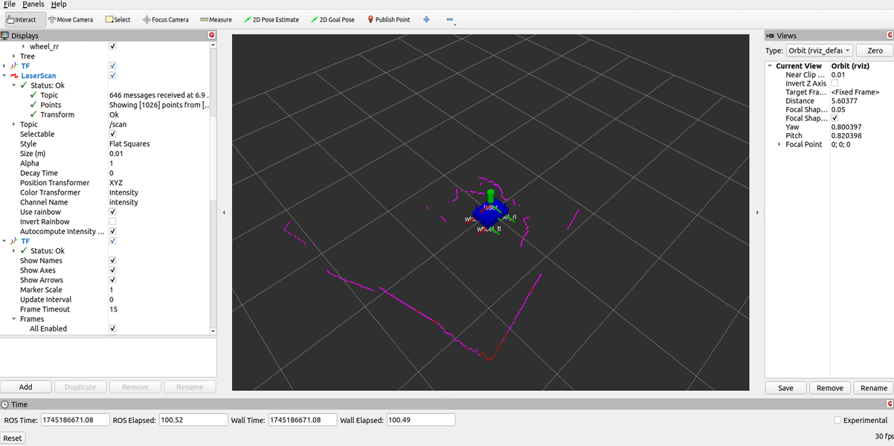
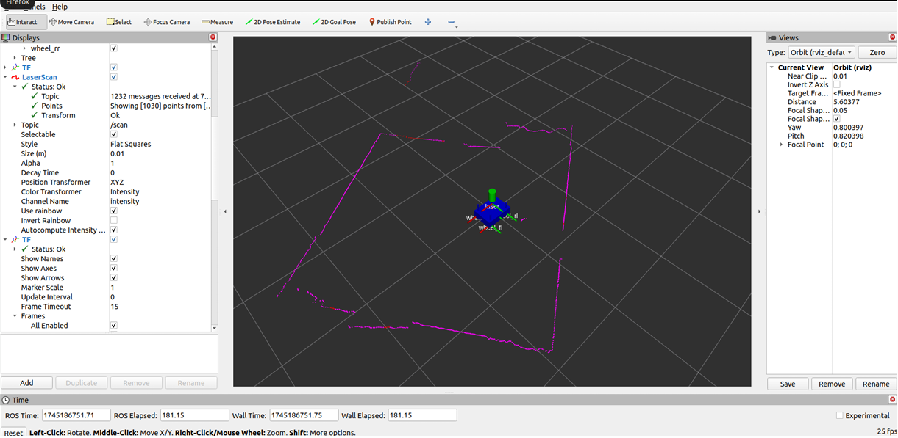

# 🤖 Autonomous Obstacle-Avoiding 4-Wheeled Robot with Servo Scanning and ROS 2 LiDAR Visualization
Built using Arduino Uno, HC-SR04 Ultrasonic Sensor, and RPLIDAR A1
🔧 Powered by dual 3C-rated 18650 Li-ion cells with sensor shield integration
 
## 📌 Project Overview:
This project presents a smart autonomous ground robot capable of detecting and avoiding obstacles in real-time using ultrasonic scanning and precise motor control. Designed around the Arduino Uno, it combines real-world sensor interfacing, mechanical motion control, and ROS 2-based LiDAR visualization — making it ideal for robotics prototyping, education, and research extensions.
 
## 🔩 Hardware Architecture:
Component	Specification / Pin Mapping 
- Microcontroller	Arduino Uno with Sensor Shield (for easy wiring)
- Motors	4x DC BO motors (geared), driven by L298N driver
- Ultrasonic Sensor	HC-SR04 (Trig=A5, Echo=A4)
- Servo Motor	SG90 (for scanning), Pin = 3
- Motor Control Pins	ENA=6, ENB=5, IN1=11, IN2=9, IN3=8, IN4=7
- Power Source	2x 18650 Li-ion 3C batteries (7.4V approx)
- LiDAR: RPLIDAR A1 with ROS 2 and RViz
- HC-05 bluetooth module

## 🧠 Working Logic :
#### Scanning & Sensing:
The ultrasonic sensor, mounted on a servo, rotates to scan the front-left, center, and front-right directions. It measures the distance to nearby objects in all three zones.

#### Decision-Making Algorithm:

Clear path ➝ Move forward.

Obstacle ahead ➝ Compare left/right distances.

Turn toward the clearer direction, bypass the obstacle, and return to the original path using timed 90° turns.

#### Motor Control & Speed Management:
Differential drive with speed compensation ensures smooth navigation. The L298N module takes PWM inputs for motor speed and direction.

#### Power Management:
Dual 18650 Li-ion batteries supply the circuit through the sensor shield, ensuring organized power distribution.
  
➡️ [**Obstacle_avoidance_final_code.ino**](./Obstacle_avoidance_final_code.ino)

## 🌐 ROS 2 Integration (Advanced Layer):
Using RPLIDAR A1, the robot integrates with ROS 2 Humble for real-time 2D environment scanning and visualization:

TF Frames: map → odom → base_link → laser

URDF: Represents the robot structure in RViz

Visualization: Laser scan (/scan) viewable in RViz GUI
  
➡️ [**ROS 2 commands for lidar**](./commands_for_lidar)
  
### 🔍 Sample LiDAR Scans from RViz

  

  

 🌟Key Features  
 Modular Sensor Shield-based wiring for ease of maintenance

Servo-based directional scanning (left, center, right)

Autonomous obstacle detection & avoidance

ROS 2 compatibility with LiDAR visualization

Expandable for line following, Bluetooth remote control

## 📈 Applications & Extensions
Educational robotics and DIY prototyping

Indoor surveillance or warehouse bots

SLAM algorithm testing platform

Vision and ML integration (future upgrade)

